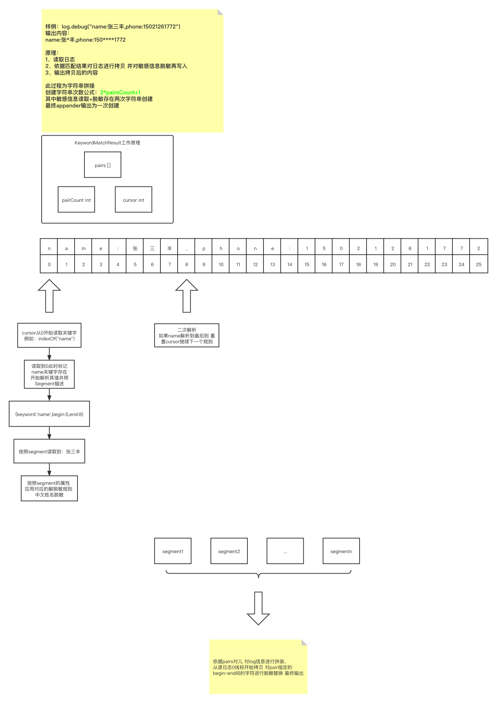

### 脱敏组件使用文档

### 前言

随着信息安全不断地深入人心，对开发者的挑战也是逐日增加，当下微服务系统日志文件也不失为信息安全风险点之一。
系统日志一般会打印较多的业务参数，甚至重要的客户信息。因此必须确保输出到控制台和磁盘的log是安全的。脱敏组件因此而诞生！它应用于各大日志组件，能在日志输出之前对信息进行处理，它甚至可以动态地配置丰富的脱敏规则，来应对多变的客户要求。

#### 编写语言

Java

#### 作者

王伦

#### 说明

脱敏是对原有日志信息进行安全处理，其解析、处理两个阶段难免存在一定的时间、空间消耗，这属于正常情况。
为了迎合不同业务线系统的脱敏，本组件设定了多个配置项，均通过logback.xml配置设定。比如为了提升脱敏性能，设定有脱敏深度、脱敏规则、中断标志符、字符串缓存开关等多项配置，具体以下面的配置文件为准！
本组件基于logback开发 是对logback日志的脱敏实现，具备高性能，伸缩性强等特性。

脱敏实现规则：

- 手机号【mobile_phone】
- 身份证号【id_card】
- 银行卡号【bank_card】
- 中文姓名【chinese_name】
- 邮箱地址【email】
- 密码【password】

目前脱敏分两种实现：

- 关键字索引脱敏 【性能最优】
  
- 正则替换脱敏

### 类图


### 主要功能

- 丰富的脱敏规则
- 丰富的匹配条件
- 丰富的脱敏实现
- 性能分析

使用脱敏组件您可控制：

- 总开关
- 配置脱敏深度，单条日志超过指定砝值后不再脱敏
- 控制脱敏条件，仅对满足条件的日志开启脱敏
- 脱敏策略引擎配置，选择哪一种脱敏实现
- 脱敏规则，可选择性的决定那些敏感信息需要脱敏
- 敏感信息结束符号，更快、更丰富的脱敏解析器
- 字符串intern开关，取决于倾向节省heap内存还是性能

### 使用

1、maven依赖

```xml
<?xml version="1.0" encoding="UTF-8"?>
<dependency>
  <groupId>io.kings</groupId>
  <artifactId>kings-framework-log-desensitize</artifactId>
  <version>1.0.0-SNAPSHOT</version>
</dependency>
```

2、logback配置

```xml
<?xml version="1.0" encoding="UTF-8"?>
<configuration>
  <property name="APP_NAME" value="desensitize-demo"/>
  <!--  脱敏开关  -->
  <property name="LOG_DESENSITIZE" value="true"/>
  <!--  脱敏深度 超过将不再脱敏 -->
  <property name="LOG_DESENSITIZE_DEPTH" value="2"/>
  <!--  脱敏日志最大长度 超过将不再脱敏 -->
  <property name="LOG_DESENSITIZE_MAXLENGTH" value="1024"/>
  <!--  脱敏日志解析方案 有关键字解析(KEYWORD)、正则解析(REGEXP)【默认 KEYWORD 】-->
  <property name="LOG_DESENSITIZE_MATCH_TYPE" value="KEYWORD"/>
  <!--  是否启用string intern节约heap内存-->
  <property name="LOG_DESENSITIZE_USE_STRING_INTERN" value="false"/>
  <!--  规则配置 仅配置的key会参与脱敏 格式key:alias-->
  <property name="LOG_DESENSITIZE_MATCH_REGULAR"
    value="MOBILE_PHONE:mobile|chinese_name:name"/>
  <!--  keyword匹配解析结束标志符-->
  <property name="LOG_DESENSITIZE_MATCH_REGULAR_END_WITH" value=","/>
  <include resource="base-logback.xml"/>
</configuration>
```

3、编码 log使用没有任何区别。需要注意的是如果在引入脱敏组件，且总开关打开的情况下。既有的场景不需要脱敏，有的场景需要脱敏，也就是脱敏和不脱敏共存。这需要logback在include
base-logback之前自定义appender。

### 报告和输出

为了对本组件进行性能测试和分析，以下数据是对'mobile_phone=15021261772,chinese_name=张三丰'
信息的脱敏处理，分别针对脱敏、不脱敏进行高达10轮验证、并取其平均值：
<table>
    <tr><td>次数</td><td>不脱敏耗时</td><td>关键字脱敏</td><td>损耗倍数</td><td>正则脱敏</td><td>损耗倍数</td></tr>
    <tr><td>1000</td><td>8.6</td><td>19.3</td><td>2.24</td><td>42.8</td><td>4.98</td></tr>
    <tr><td>10000</td><td>49.6</td><td>107.2</td><td>2.16</td><td>210.6</td><td>4.25</td></tr>
    <tr><td>100000</td><td>371.4</td><td>590.8</td><td>1.59</td><td>1150.0</td><td>3.10</td></tr>
    <tr><td>1000000</td><td>4965.8</td><td>6550.6</td><td>1.32</td><td>13647.8</td><td>2.75</td></tr>
    <tr><td>10000000</td><td>60782.6</td><td>70008.6</td><td>1.15</td><td>135767.4</td><td>2.23</td></tr>
</table>

综上数据面板粗略得出用以下结论：

- 性能损失随着log频繁度逐渐降低
- 脱敏过程包含：解析、'*'替换处理 这一定存在性能损耗
- 由上可知大约在1kw次log时关键字脱敏性能最佳 约等于1.15倍于不脱敏 几乎无损耗 这大概就是字符串缓存池【intern】的功效。
- 正则匹配相比关键字匹配性能要高两倍之余【原因？优化？】

正则损耗点：

- match过程 匹配失败频率越大性能越低 这是正则的痛点
- replace过程 会导致字符串重建 大量的创建过程也是性能损耗点

综上 不建议使用正则脱敏！除非不在乎性能【开放正则表达式TODO 目前是代码写死的】

#### jmh性能验证

jmh测试报告 （Score:平均耗时值 Error:误差）

| Benchmark                          | (printLogCount) | Mode | Cnt | Score     | Error  | Units |
|------------------------------------|-----------------|------|-----|-----------|--------|-------|
| DesensitizeBenchmark.desensitize   | 1000            | avg  | 3   | 5.541 ±   | 2.192  | ms/op |
| DesensitizeBenchmark.desensitize   | 10000           | avg  | 3   | 63.644 ±  | 5.130  | ms/op |
| DesensitizeBenchmark.desensitize   | 100000          | avg  | 3   | 563.921 ± | 80.573 | ms/op |
| DesensitizeBenchmark.noDesensitize | 1000            | avg  | 3   | 5.165 ±   | 8.419  | ms/op |
| DesensitizeBenchmark.noDesensitize | 10000           | avg  | 3   | 51.052 ±  | 5.726  | ms/op |
| DesensitizeBenchmark.noDesensitize | 100000          | avg  | 3   | 537.349 ± | 33.744 | ms/op |

上述报告分别对脱敏组件的jmh性能测试，为了保证数据的准确和真实性先对进行预热。详细可参考<a href="https://www.jianshu.com/p/0da2988b9846">
jmh用法</a>。通过上述报告可以看出在进行预热之后脱敏表现最优